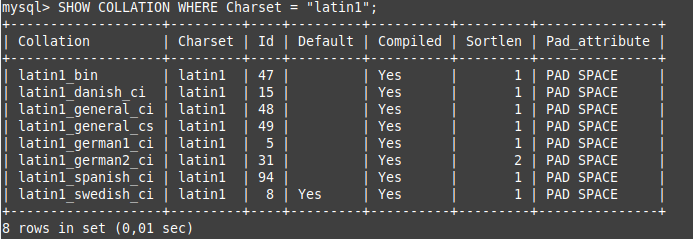
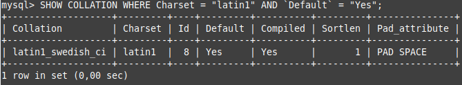

# Ejercicio 2
Muestra todos los collations disponibles para el conjunto de caracteres latin1. ¿Cuál es el collation predeterminado de latin1?

Nota: hay que generar dos consultas: una por cada pregunta.
```
SHOW COLLATION WHERE Charset = "latin1";
SHOW COLLATION WHERE Charset = "latin1" AND `Default` = "Yes"; -- Swedish1
```


