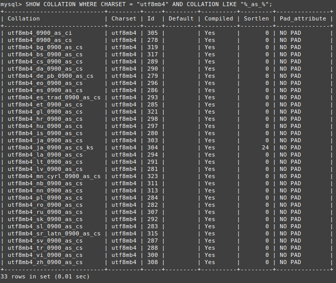
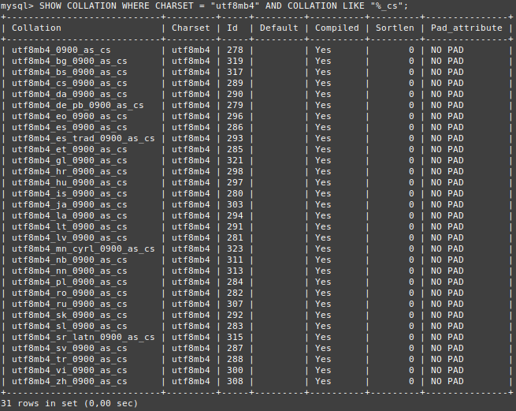

# Ejercicio 3
Filtra las collations del conjunto utf8mb4 que sean sensibles a acentos (as). Filtra las collations del conjunto utf8mb4 que sean sensibles a mayúsculas (cs).

Nota: hay que generar dos consultas: una por cada pregunta.
```
SHOW COLLATION WHERE CHARSET = "utf8mb4" AND COLLATION LIKE "%_as_%";
SHOW COLLATION WHERE CHARSET = "utf8mb4" AND COLLATION LIKE "%_cs";
```


