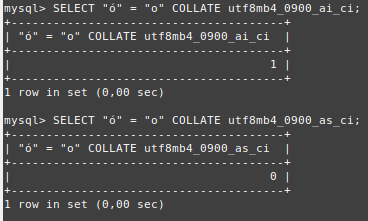

# Ejercicio 4
Compara si ó es igual a o utilizando el collation utf8mb4_0900_ai_ci. Compara si ó es diferente de o utilizando el collation utf8mb4_0900_as_ci.

Nota: hay que generar dos consultas: una por cada pregunta.
```
SELECT "ó" = "o" COLLATE utf8mb4_0900_ai_ci; -- Devuelve 1
SELECT "ó" = "o" COLLATE utf8mb4_0900_as_ci; -- Devuelve 0

```

