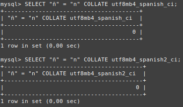

# Ejercicio 5
Compara si la ñ es igual a n utilizando los collations utf8mb4_spanish_ci y utf8mb4_spanish2_ci.
```
SELECT "ñ" = "n" COLLATE utf8mb4_spanish_ci; -- Devuelve 0
SELECT "ñ" = "n" COLLATE utf8mb4_spanish2_ci; -- Devuelve 0
```

