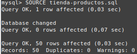
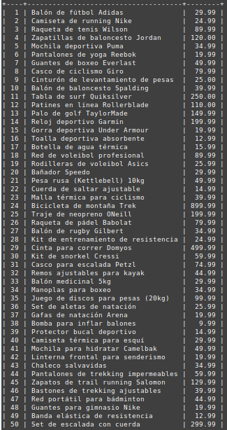

# Ejercicio 9
Cargar el siguiente fichero [`tienda-productos.sql`](tienda-productos.sql) en Base de Datos. Para ello utiliza el comando `SOURCE` con rutas relativas:

`SOURCE tienda-productos.sql;` 

