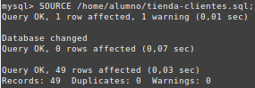
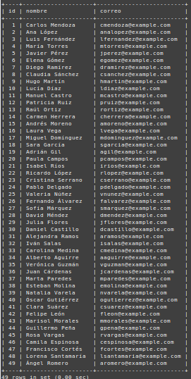

# Ejercicio 10
Cargar el siguiente fichero [`tienda-clientes.sql`](tienda-clientes.sql) en Base de Datos. Para ello utiliza el comando `SOURCE` con rutas absolutas:

`SOURCE /home/alumno/tienda-clientes.sql;`

